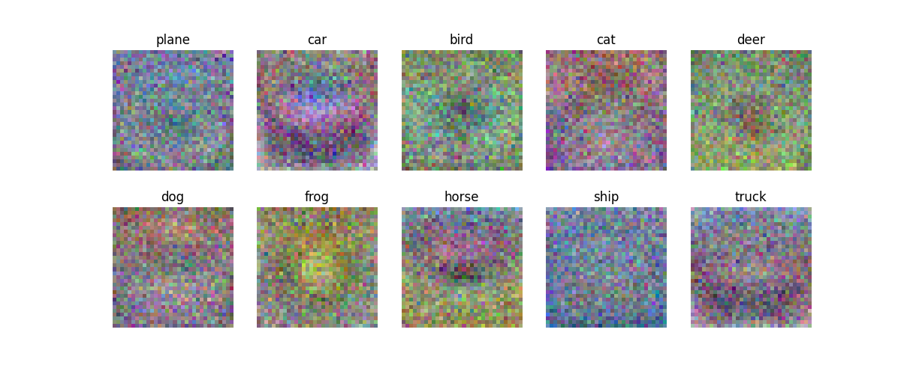
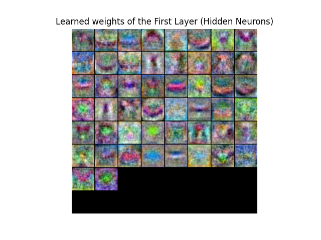
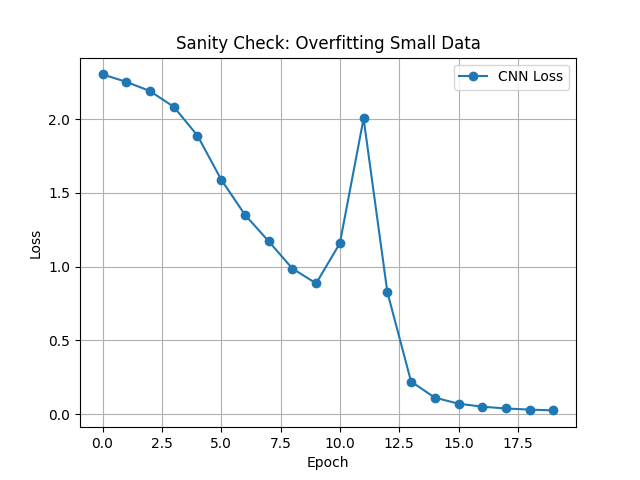

# DL-Foundation-from-Scratch
Stanford Lecture - CS231n theory implementation using NumPy for deep learning fundamentals

## 1. k-Nearest Neighbor (k-NN) Implementation
Implemented a complete k-NN classifier from scratch using NumPy.

* **Vectorization:** optimized performance by replacing nested loops with matrix operations (Broadcasting), achieving significant speedup.
* **Hyperparameter Tuning:** Conducted K-fold cross-validation to find the optimal $k$.
* **Modules:**
    * `k_nn_utils.py`: Core logic for distance calculation (L2) and prediction.
    * `knn_cifar10.py`: Script for training, testing, and visualization.

---

## 🔬 Experiment & Analysis: Limitations of k-NN
### Hypothesis & Experiment
Investigated the relationship between dataset size and model performance to verify the effectiveness of Pixel-wise L2 distance in high-dimensional space (CIFAR-10).
* **Setup:** Compared accuracy between small dataset ($N=5,000$) and full dataset ($N=50,000$).
* **Result:** Accuracy saturated around **33%** despite a 10x increase in data.

### Key Insights
**1. The Curse of Dimensionality**
Even with 50,000 samples, the data remains sparse in the 3,072-dimensional space. The distance to the nearest neighbor does not decrease significantly, leading to diminishing returns in performance (Logarithmic growth).

**2. Semantic Gap in L2 Distance**
* **Observation:** The model often misclassifies images based on dominant background colors rather than object shapes.
* **Analysis:** L2 distance calculates the sum of independent pixel differences. It is sensitive to **global color distributions** (e.g., green background) but fails to capture **local semantic features** (e.g., edges, shapes).
* **Conclusion:** Pure data scaling cannot overcome the structural limitations of pixel-based distance metrics. This necessitates the use of feature-extraction-based models like Linear Classifiers or CNNs.

## 2. Linear Classifier (SVM) Implementation
Implemented a Multiclass SVM (Hinge Loss) classifier to overcome the memory and prediction speed limitations of k-NN.

* **Parametric Approach:** Transitioned from memory-based (k-NN) to model-based learning ($f(x, W) = Wx + b$), compressing the knowledge of the entire dataset into a weight matrix $W$.
* **Fully Vectorized Loss:** Implemented the SVM loss function without explicit loops, utilizing NumPy broadcasting and advanced indexing for massive performance gains.
* **Modules:**
    * `linear_classifier.py`: Implements forward pass (score calculation) and vectorized loss computation.

---

## 🔬 Experiment & Analysis: Initial Loss Verification
### Context & Observation
Verified the correctness of the vectorized implementation by analyzing the initial loss value with unoptimized random weights.
* **Setup:** Initialized $W$ using standard normal distribution (`np.random.randn`) scaled by $0.01$. Input images were scaled to $[0, 1]$.
* **Result:** Calculated Initial Loss $\approx 338.4$ (on $N=50,000$).

### Key Insights
**1. Validation of Vectorization**
The calculation for 50,000 images was completed almost instantly. The resulting loss value (~338) aligns with the expected theoretical range for unnormalized random weights, confirming that the broadcasting and masking logic works correctly across the entire batch.

**2. The Need for Optimization**
Unlike k-NN, where performance is fixed by the dataset, this high loss value serves as the baseline for learning. The quantitative loss metric proves that the current random model is failing to classify correctly, setting the stage for implementing **Gradient Descent** to minimize this loss.

## 3. Optimization & Training
Implemented the core training logic to minimize the SVM Loss using Gradient Descent.

* **Analytic Gradient:** Derived and implemented the gradient of the SVM loss function ($\nabla_W L$) using fully vectorized NumPy operations, avoiding inefficient numerical differentiation.
* **Stochastic Gradient Descent (SGD):** Transformed the training loop from Batch Gradient Descent (using all 50k images) to SGD (Mini-batch size: 200), achieving massive speed improvements.
* **Hyperparameter Tuning:** Experimented with Learning Rate and Batch Size to stabilize training.

---

## 🔬 Experiment Log: Overcoming Challenges
### 1. The "Exploding Gradient" Incident
* **Observation:** During the first training attempt, the Loss skyrocketed from **321** to **71,047** within 10 iterations (Divergence).
* **Root Cause Analysis:**
    * The input data was unscaled ($0 \sim 255$), resulting in large score values.
    * The large scores caused massive gradients, and combined with the learning rate, the weights updated too aggressively ("overshooting" the minima).
* **Solution:**
    * **Data Preprocessing:** Applied Normalization (`X_train /= 255.0`) to scale pixel values between $[0, 1]$.
    * **Type Casting:** Converted data to `float32` before division to prevent type mismatch errors.

### 2. Successful Convergence & SGD Analysis
* **Result after Fix:**
    * **Initial Loss:** Dropped to **10.6** (Close to the theoretical expected loss for random weights: $\approx 9.0$).
    * **Training Dynamics:** Loss decreased steadily without divergence.
* **SGD Efficiency:**
    * Switching to SGD (Batch size 200) accelerated the training loop by approx. **250x** compared to Batch GD.
    * **Final Loss:** Reached **~7.9** after 1,500 iterations.
    * **Fluctuation:** Observed the characteristic "noisy" descent of SGD (e.g., Loss jumping 8.7 $\to$ 9.3 $\to$ 7.9), confirming the stochastic nature of sampling.

## 4. Final Evaluation & Visualization
Successfully evaluated the best SVM model on the test set and visualized the learned templates.

* **Hyperparameter Tuning:** Searched through multiple `learning_rates` and `reg_strengths`.
    * **Best Combination:** `lr: 0.001`, `reg: 0.25`
    * **Best Validation Accuracy:** 36.20%
* **Final Test Performance:** Achieved **33.66%** Accuracy on the CIFAR-10 test set.
* **Weight Visualization:** Observed that the model learns "spatial templates" for each class (e.g., green blobs for frogs, blue backgrounds for ships).
* The following images represent the learned weights (templates) for each class:

## 5. Neural Network Visualization
Unlike the linear classifier, the two-layer neural network learns distributed representations. The following image shows the weights ($W_1$) learned by the 50 hidden neurons:

* **Observation:** The neurons act as various filters for edges, colors, and blobs, which are then combined in the second layer to classify the image.

## 6. Convolutional Neural Network (CNN) Implementation
Implemented a modular Convolutional Neural Network (CNN) from scratch to capture spatial hierarchies in image data, moving beyond the limitations of flat vector inputs used in Linear Classifiers and MLPs.

* **Full Modular Architecture:** Implemented `Conv - ReLU - Pool - Affine - ReLU - Affine - Softmax` architecture.
* **Manual Backpropagation:** Derived and implemented the analytic gradients for Convolution and Max Pooling layers using the Chain Rule, handling 4D tensors ($N, C, H, W$) without automatic differentiation.
* **Modules:**
    * `layers.py`: Contains `forward` and `backward` methods for `Conv_naive`, `MaxPool_naive`, etc.
    * `cnn.py`: Assembles the layers into a `ThreeLayerConvNet` class.
    * `train_overfit.py`: Script for verifying implementation integrity.

---

## 🔬 Experiment & Analysis: Implementation Verification
### Context & Observation
Before training on the full dataset, it is crucial to verify the correctness of the complex backpropagation logic (specifically dimensions and gradient flow in 4D tensors).
* **Setup:** Trained the model on a tiny dataset ($N=5$ images) with a high learning rate ($0.1$) for 20 epochs.
* **Hypothesis:** If the forward and backward passes are implemented correctly, the model should have enough capacity to perfectly memorize (overfit) the small dataset, driving the loss to near zero.
* **Result:**
    * **Initial Loss:** $\approx 2.3$ (Random guessing).
    * **Final Loss:** $\approx 0.02$ (Perfect memorization).

### Key Insights
**1. Validation of Gradient Flow (Chain Rule)**
The convergence to near-zero loss confirms that the gradient of the loss function is correctly flowing back through the Max Pooling (routing gradients to max indices) and Convolution layers (cross-correlating gradients with filters). If there were any dimension mismatch or mathematical error in `conv_backward`, the loss would have stagnated or exploded.

**2. SGD Dynamics: The "Overshooting" Phenomenon**
* **Observation:** During the training (Epoch 10-12), the loss temporarily spiked ($0.86 \to 1.93$) before settling down.
* **Analysis:** This illustrates the behavior of Stochastic Gradient Descent with a high learning rate. The optimizer "overshot" the local minimum due to the large step size but successfully corrected its trajectory. This confirms that the update logic ($W \leftarrow W - \eta \cdot \nabla W$) is working robustly even under aggressive hyperparameter settings.

## 🔬 Experiment & Analysis: Overfitting Test (Sanity Check)

To verify the correctness of the implementation (especially Backpropagation), I conducted a "Sanity Check" by overfitting a small dataset ($N=5$).

### 📊 Experiment 1: Conservative Learning Rate
* **Setup:** `learning_rate = 0.01`, `epochs = 20`
* **Observation:** The loss decreased very slowly ($2.29 \to 2.03$).
* **Analysis:** The gradient updates were too small to converge within 20 epochs. This indicated the need for a more aggressive learning rate for this tiny dataset.

### 📊 Experiment 2: Aggressive Learning Rate (Success)
* **Setup:** `learning_rate = 0.1`, `epochs = 20`
* **Observation:**
    * **Overshooting:** A spike in loss occurred at Epoch 11 ($1.16$) and 12 ($2.00$), indicating the step size was large enough to jump over the local minima temporarily.
    * **Convergence:** The optimizer successfully corrected the trajectory, driving the final loss to **0.0225**.
* **Conclusion:** The model has sufficient capacity to memorize the dataset, confirming that the `forward` and `backward` passes are mathematically correct.

