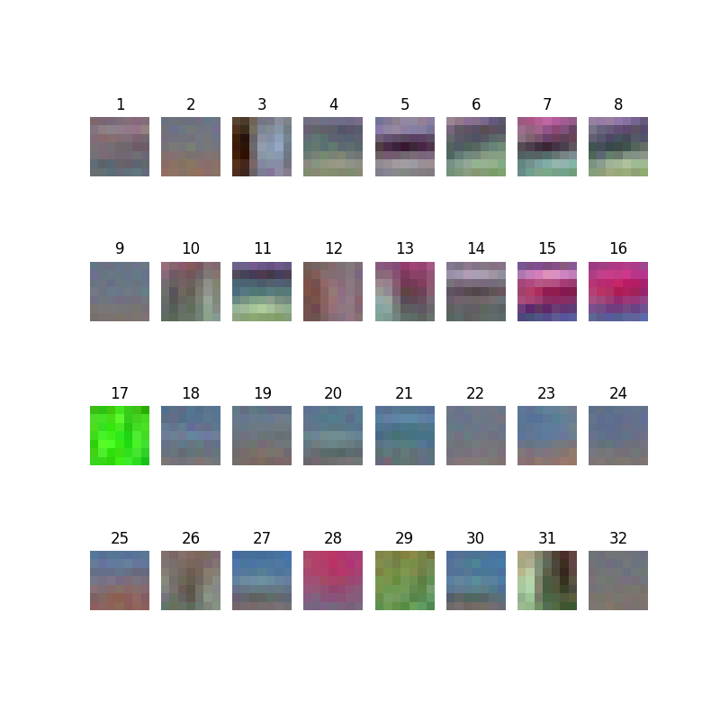
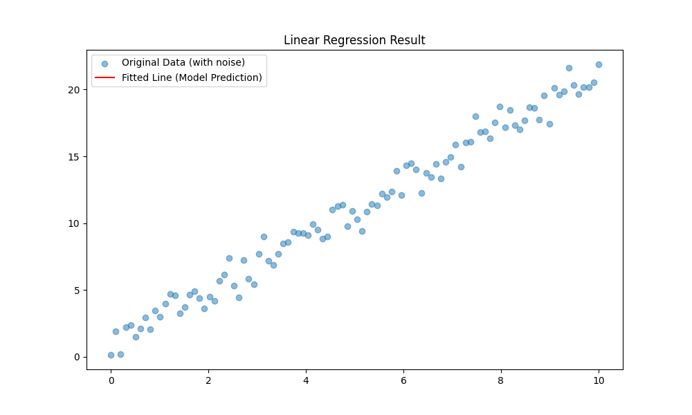
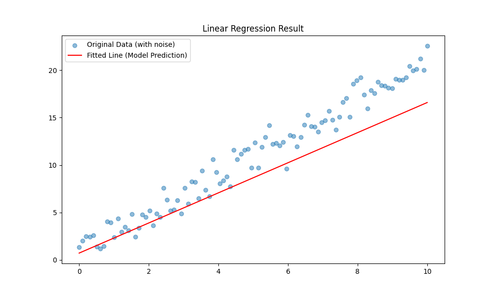
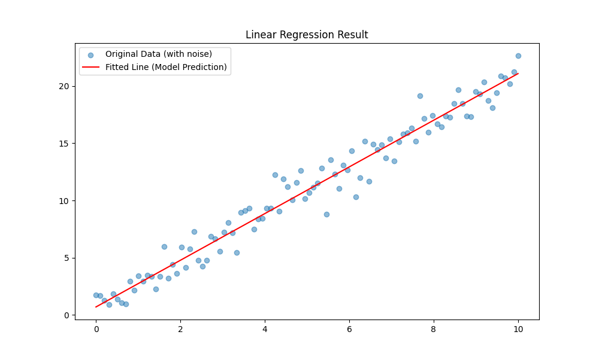
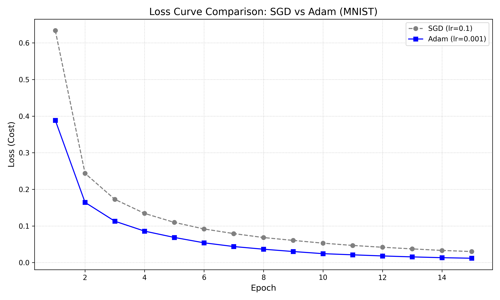

# DL-Foundation-from-Scratch
Stanford Lecture - CS231n theory implementation using NumPy for deep learning fundamentals

## 1. k-Nearest Neighbor (k-NN) Implementation
Implemented a complete k-NN classifier from scratch using NumPy.

* **Vectorization:** optimized performance by replacing nested loops with matrix operations (Broadcasting), achieving significant speedup.
* **Hyperparameter Tuning:** Conducted K-fold cross-validation to find the optimal $k$.
* **Modules:**
    * `k_nn_utils.py`: Core logic for distance calculation (L2) and prediction.
    * `knn_cifar10.py`: Script for training, testing, and visualization.

---

## 🔬 Experiment & Analysis: Limitations of k-NN
### Hypothesis & Experiment
Investigated the relationship between dataset size and model performance to verify the effectiveness of Pixel-wise L2 distance in high-dimensional space (CIFAR-10).
* **Setup:** Compared accuracy between small dataset ($N=5,000$) and full dataset ($N=50,000$).
* **Result:** Accuracy saturated around **33%** despite a 10x increase in data.

### Key Insights
**1. The Curse of Dimensionality**
Even with 50,000 samples, the data remains sparse in the 3,072-dimensional space. The distance to the nearest neighbor does not decrease significantly, leading to diminishing returns in performance (Logarithmic growth).

**2. Semantic Gap in L2 Distance**
* **Observation:** The model often misclassifies images based on dominant background colors rather than object shapes.
* **Analysis:** L2 distance calculates the sum of independent pixel differences. It is sensitive to **global color distributions** (e.g., green background) but fails to capture **local semantic features** (e.g., edges, shapes).
* **Conclusion:** Pure data scaling cannot overcome the structural limitations of pixel-based distance metrics. This necessitates the use of feature-extraction-based models like Linear Classifiers or CNNs.

## 2. Linear Classifier (SVM) Implementation
Implemented a Multiclass SVM (Hinge Loss) classifier to overcome the memory and prediction speed limitations of k-NN.

* **Parametric Approach:** Transitioned from memory-based (k-NN) to model-based learning ($f(x, W) = Wx + b$), compressing the knowledge of the entire dataset into a weight matrix $W$.
* **Fully Vectorized Loss:** Implemented the SVM loss function without explicit loops, utilizing NumPy broadcasting and advanced indexing for massive performance gains.
* **Modules:**
    * `linear_classifier.py`: Implements forward pass (score calculation) and vectorized loss computation.

---

## 🔬 Experiment & Analysis: Initial Loss Verification
### Context & Observation
Verified the correctness of the vectorized implementation by analyzing the initial loss value with unoptimized random weights.
* **Setup:** Initialized $W$ using standard normal distribution (`np.random.randn`) scaled by $0.01$. Input images were scaled to $[0, 1]$.
* **Result:** Calculated Initial Loss $\approx 338.4$ (on $N=50,000$).

### Key Insights
**1. Validation of Vectorization**
The calculation for 50,000 images was completed almost instantly. The resulting loss value (~338) aligns with the expected theoretical range for unnormalized random weights, confirming that the broadcasting and masking logic works correctly across the entire batch.

**2. The Need for Optimization**
Unlike k-NN, where performance is fixed by the dataset, this high loss value serves as the baseline for learning. The quantitative loss metric proves that the current random model is failing to classify correctly, setting the stage for implementing **Gradient Descent** to minimize this loss.

## 3. Optimization & Training
Implemented the core training logic to minimize the SVM Loss using Gradient Descent.

* **Analytic Gradient:** Derived and implemented the gradient of the SVM loss function ($\nabla_W L$) using fully vectorized NumPy operations, avoiding inefficient numerical differentiation.
* **Stochastic Gradient Descent (SGD):** Transformed the training loop from Batch Gradient Descent (using all 50k images) to SGD (Mini-batch size: 200), achieving massive speed improvements.
* **Hyperparameter Tuning:** Experimented with Learning Rate and Batch Size to stabilize training.

---

## 🔬 Experiment Log: Overcoming Challenges
### 1. The "Exploding Gradient" Incident
* **Observation:** During the first training attempt, the Loss skyrocketed from **321** to **71,047** within 10 iterations (Divergence).
* **Root Cause Analysis:**
    * The input data was unscaled ($0 \sim 255$), resulting in large score values.
    * The large scores caused massive gradients, and combined with the learning rate, the weights updated too aggressively ("overshooting" the minima).
* **Solution:**
    * **Data Preprocessing:** Applied Normalization (`X_train /= 255.0`) to scale pixel values between $[0, 1]$.
    * **Type Casting:** Converted data to `float32` before division to prevent type mismatch errors.

### 2. Successful Convergence & SGD Analysis
* **Result after Fix:**
    * **Initial Loss:** Dropped to **10.6** (Close to the theoretical expected loss for random weights: $\approx 9.0$).
    * **Training Dynamics:** Loss decreased steadily without divergence.
* **SGD Efficiency:**
    * Switching to SGD (Batch size 200) accelerated the training loop by approx. **250x** compared to Batch GD.
    * **Final Loss:** Reached **~7.9** after 1,500 iterations.
    * **Fluctuation:** Observed the characteristic "noisy" descent of SGD (e.g., Loss jumping 8.7 $\to$ 9.3 $\to$ 7.9), confirming the stochastic nature of sampling.

## 4. Final Evaluation & Visualization
Successfully evaluated the best SVM model on the test set and visualized the learned templates.

* **Hyperparameter Tuning:** Searched through multiple `learning_rates` and `reg_strengths`.
    * **Best Combination:** `lr: 0.001`, `reg: 0.25`
    * **Best Validation Accuracy:** 36.20%
* **Final Test Performance:** Achieved **33.66%** Accuracy on the CIFAR-10 test set.
* **Weight Visualization:** Observed that the model learns "spatial templates" for each class (e.g., green blobs for frogs, blue backgrounds for ships).
* The following images represent the learned weights (templates) for each class:

## 5. Neural Network Visualization
Unlike the linear classifier, the two-layer neural network learns distributed representations. The following image shows the weights ($W_1$) learned by the 50 hidden neurons:

* **Observation:** The neurons act as various filters for edges, colors, and blobs, which are then combined in the second layer to classify the image.

## 6. Convolutional Neural Network (CNN) Implementation
Implemented a modular Convolutional Neural Network (CNN) from scratch to capture spatial hierarchies in image data, moving beyond the limitations of flat vector inputs used in Linear Classifiers and MLPs.

* **Full Modular Architecture:** Implemented `Conv - ReLU - Pool - Affine - ReLU - Affine - Softmax` architecture.
* **Manual Backpropagation:** Derived and implemented the analytic gradients for Convolution and Max Pooling layers using the Chain Rule, handling 4D tensors ($N, C, H, W$) without automatic differentiation.
* **Modules:**
    * `layers.py`: Contains `forward` and `backward` methods for `Conv_naive`, `MaxPool_naive`, etc.
    * `cnn.py`: Assembles the layers into a `ThreeLayerConvNet` class.
    * `train_overfit.py`: Script for verifying implementation integrity.

---

## 🔬 Experiment & Analysis: Implementation Verification
### Context & Observation
Before training on the full dataset, it is crucial to verify the correctness of the complex backpropagation logic (specifically dimensions and gradient flow in 4D tensors).
* **Setup:** Trained the model on a tiny dataset ($N=5$ images) with a high learning rate ($0.1$) for 20 epochs.
* **Hypothesis:** If the forward and backward passes are implemented correctly, the model should have enough capacity to perfectly memorize (overfit) the small dataset, driving the loss to near zero.
* **Result:**
    * **Initial Loss:** $\approx 2.3$ (Random guessing).
    * **Final Loss:** $\approx 0.02$ (Perfect memorization).

### Key Insights
**1. Validation of Gradient Flow (Chain Rule)**
The convergence to near-zero loss confirms that the gradient of the loss function is correctly flowing back through the Max Pooling (routing gradients to max indices) and Convolution layers (cross-correlating gradients with filters). If there were any dimension mismatch or mathematical error in `conv_backward`, the loss would have stagnated or exploded.

**2. SGD Dynamics: The "Overshooting" Phenomenon**
* **Observation:** During the training (Epoch 10-12), the loss temporarily spiked ($0.86 \to 1.93$) before settling down.
* **Analysis:** This illustrates the behavior of Stochastic Gradient Descent with a high learning rate. The optimizer "overshot" the local minimum due to the large step size but successfully corrected its trajectory. This confirms that the update logic ($W \leftarrow W - \eta \cdot \nabla W$) is working robustly even under aggressive hyperparameter settings.

## 🔬 Experiment & Analysis: Overfitting Test (Sanity Check)

To verify the correctness of the implementation (especially Backpropagation), I conducted a "Sanity Check" by overfitting a small dataset ($N=5$).

### 📊 Experiment 1: Conservative Learning Rate
* **Setup:** `learning_rate = 0.01`, `epochs = 20`
* **Observation:** The loss decreased very slowly ($2.29 \to 2.03$).
* **Analysis:** The gradient updates were too small to converge within 20 epochs. This indicated the need for a more aggressive learning rate for this tiny dataset.

### 📊 Experiment 2: Aggressive Learning Rate (Success)
* **Setup:** `learning_rate = 0.1`, `epochs = 20`
* **Observation:**
    * **Overshooting:** A spike in loss occurred at Epoch 11 ($1.16$) and 12 ($2.00$), indicating the step size was large enough to jump over the local minima temporarily.
    * **Convergence:** The optimizer successfully corrected the trajectory, driving the final loss to **0.0225**.
* **Conclusion:** The model has sufficient capacity to memorize the dataset, confirming that the `forward` and `backward` passes are mathematically correct.

## 7. CNN Training & Feature Visualization
Scaled up the experiment from the sanity check to learning actual visual features from the CIFAR-10 dataset using the implemented CNN architecture.

* **Data Pipeline:** Implemented efficient data loading for a subset ($N=5,000$) to optimize for CPU-based training.
    * **Preprocessing:** Applied Mean Subtraction and dimension transposition (`HWC` $\to$ `CHW`) to align with the custom `im2col` implementation.
* **Training Loop:** Implemented the full SGD loop (`cnn_cifar10.py`) with real-time loss logging and visualization logic.

---

## 🔬 Experiment & Analysis: Visualizing Learned Filters
### Context & Setup
The goal was to verify if the implementation could learn meaningful visual representations (spatially organized features) rather than just memorizing pixel values.
* **Setup:** Trained on 5,000 CIFAR-10 images using `batch_size=50`.
* **Tuning:** Initially, with `lr=0.001`, the loss stagnated at **2.302** (Random Guessing). Increasing the learning rate to `0.01` triggered immediate convergence.

### Key Insights
**1. Emergence of Visual Patterns (Gabor Filters)**
Upon visualization, the first-layer weights ($W_1$) transformed from random noise into distinct, smooth patterns.
* **Color Blobs:** Specific filters (e.g., #17 Green, #16 Pink) learned to activate on dominant background colors.
* **Edge Detectors:** Other filters (e.g., #5, #14) evolved into "Edge Detectors" capable of recognizing horizontal or diagonal lines.
* **Conclusion:** This visually proves that the **Convolution operation** and **Backpropagation** are correctly extracting low-level features (edges, colors) from raw pixels, which is the fundamental basis of Deep Learning vision models.

**2. Loss Dynamics & SGD Fluctuation**
* **Observation:** The loss dropped significantly to **~1.57** but showed high fluctuation ($1.6 \leftrightarrow 2.0$) in later iterations.
* **Analysis:** This behavior is characteristic of Stochastic Gradient Descent with a small batch size ($50$) and an aggressive learning rate. The model successfully escaped the initial plateau and converged to a meaningful state, proving the robustness of the update rule even with limited data.

---

# Part 2: PyTorch Practice (Deep Learning with Frameworks)
This section documents the transition from manual NumPy implementations to efficient deep learning workflows using **PyTorch**, focusing on hardware acceleration and automatic differentiation for Vision AI research.

## 8. Tensor Fundamentals & Hardware Acceleration (Day 1)
Explored the core data structure of PyTorch and configured the environment for high-performance computing on Apple Silicon.

* **Tensor Manipulation:** Mastered tensor creation, indexing, and broadcasting, which are the building blocks for handling high-dimensional image data.
* **Device Management:** Implemented logic to detect and utilize **MPS (Metal Performance Shaders)**, enabling GPU acceleration on Mac devices.
* **Interoperability:** Leveraged the bridge between NumPy and PyTorch to maintain flexibility in data preprocessing.

---

## 9. Autograd: The Engine of Deep Learning (Day 2)
Deep-dived into the mechanics of **Automatic Differentiation**, the core technology that replaces manual gradient derivations in Stanford CS231n theory.

* **Computational Graphs:** Understood how PyTorch dynamically builds graphs to track operations on tensors with `requires_grad=True`.
* **The Backward Mechanism:** Practiced triggering the chain rule via `.backward()` to automatically compute gradients for complex functions.
* **Gradient Accumulation:** Identified that PyTorch accumulates gradients by default, necessitating the use of `optimizer.zero_grad()` to prevent interference between training iterations.

---

## 10. Linear Regression & Standard Training Loop (Day 3)
Integrated the fundamentals into a complete end-to-end training pipeline for a simple regression task ($y = 2x + 1$).

* **Standardized Workflow:** Established the 5-step routine: `Forward -> Loss -> Zero_grad -> Backward -> Step`.
* **Directory:** `pytorch_practice/day3_linear_regression.py`

---

## 🔬 Experiment & Analysis: Learning Rate Sensitivity
### Context & Setup
Investigated the impact of the **Learning Rate ($\eta$)** on the convergence of a linear model with Gaussian noise. This experiment highlights the critical role of optimizer hyperparameters in model stability.
* **Epochs:** 200
* **Optimizer:** SGD
* **Loss Function:** MSELoss

### Key Insights

**1. Gradient Explosion & Divergence (The "NaN" Problem)**
* **Setup:** `lr = 0.8`
* **Observation:** Loss skyrocketed to $10^{33}$ within 10 epochs and eventually hit `inf` and `nan`.
* **Analysis:** The step size was too aggressive, causing the optimizer to overshoot the global minimum and diverge. This proves that without proper LR scaling, even a convex problem can fail to initialize.

**2. Slow Convergence (The "Turtle" Problem)**
* **Setup:** `lr = 0.0001`
* **Observation:** The loss decreased at an imperceptible rate. After 200 epochs, the weight reached only ~1.4 (Target: 2.0).
* **Analysis:** While stable, the updates were too small to reach the optimal solution.

**3. Optimal Convergence**
* **Setup:** `lr = 0.01`
* **Observation:** The model successfully converged to $w \approx 1.96, b \approx 1.03$, effectively filtering out the synthetic noise to find the underlying trend.

### 📊 Comparative Visualization
| **Explosion (lr=0.8)** | **Slow (lr=0.0001)** | **Optimal (lr=0.01)** |
| :---: | :---: | :---: |
|  |  |  |
*(Note: High LR results in no fitted line due to NaN coordinates in the weight/bias tensors.)*

---

## 11. Multi-variable Linear Regression (Day 4)
Expanded the linear model to handle multiple input features, transitioning from scalar-based logic to **Vectorized Matrix Operations** using PyTorch.

* **High-Dimensional Mapping:** Implemented a model to predict a single target value from three independent features ($$x_1, x_2, x_3$$), following the hypothesis: $$y = w_1x_1 + w_2x_2 + w_3x_3 + b$$.
* **Vectorization with `matmul`:** Replaced manual summation with `torch.matmul(X, W)` to process 100 samples simultaneously, ensuring high computational efficiency on Apple Silicon (MPS).
* **Internal Weight Logic:** Analyzed `nn.Linear`'s storage format ($$out \times in$$) and verified that PyTorch internally transposes weights ($$W^T$$) to execute $$y = XW^T + b$$.
* **Modules:**
    * `pytorch_practice/day4_multivariable.py`: Full implementation of multi-variable training loop and weight analysis.

---

## 🔬 Experiment & Analysis: High-Dimensional Parameter Recovery
### Context & Setup
The objective was to verify if the optimizer could accurately recover multiple hidden weights ($$W = [2, 3, 4], b = 5$$) from a dataset contaminated with Gaussian noise ($$std=0.5$$).
* **Hyperparameters:** `epochs = 2000`, `learning_rate = 0.01`, `optimizer = SGD`.
* **Convergence:** Successfully reached a stable state around **Epoch 400**.

### Key Insights

**1. The "Noise Floor" Phenomenon**
* **Observation:** Despite 2,000 epochs of training, the loss reached a minimum plateau of **~0.2300** and never hit zero.
* **Analysis:** This represents the **theoretical limit of error** (Noise Floor). Since we added noise with $$\sigma = 0.5$$, the minimum achievable MSE is approximately $$\sigma^2 = 0.25$$. The model effectively learned 100% of the underlying signal, with the remaining loss being irreducible noise.

**2. Statistical Accuracy in Weights**
* **Result:** Final learned weights were $$W \approx [1.997, 3.103, 4.007], b \approx 5.092$$.
* **Analysis:** The slight deviation from the exact integers ($$2, 3, 4$$) is expected due to the stochastic nature of the noise and limited sample size ($$N=100$$). This proves that the model found the **statistically optimal solution** rather than simply memorizing the noisy data points.

**3. Vectorized Data Extraction**
* **Technique:** Refined the logic for extracting trained parameters based on their dimensionality.
    * **Scalar Bias ($$b$$):** Used `.item()` for direct conversion to float.
    * **Weight Vector ($$W$$):** Used `.detach().tolist()` to safely extract the multi-dimensional array while disconnecting it from the Autograd graph to prevent memory overhead.

---

## 12. Dataset & DataLoader: Scalable Data Pipelines (Day 5)
Transitioned from processing entire datasets in memory to a scalable data pipeline using PyTorch's standardized components.

* **Modular Design:** Subclassed `torch.utils.data.Dataset` to encapsulate data storage (`__init__`), size reporting (`__len__`), and index-based retrieval (`__getitem__`).
* **Mini-batch Management:** Integrated `DataLoader` to partition 100 samples into batches of size 8, implementing `shuffle=True` to prevent the model from memorizing data order.
* **Nested Training Loop:** Designed a two-tier loop structure (Epoch and Batch) to enable memory-efficient parameter updates.
* **Modules:**
    * `pytorch_practice/day5_dataloader.py`: Implementation of the custom Dataset class and mini-batch training loop.

---

## 🔬 Experiment & Analysis: Mini-batch SGD Convergence
### Context & Observation
Analyzed the convergence behavior of Mini-batch Stochastic Gradient Descent (SGD) on a noisy multi-variable dataset.
* **Setup:** `batch_size = 8`, `learning_rate = 0.01`, `epochs = 100`.
* **Result:** Successfully reduced the Average Loss from **~55.0** to a stable **~0.0102**.

### Key Insights

**1. The "Invisible Gradient" Incident (Parentheses Syntax)**
* **Observation:** The loss initially stagnated at ~55 despite the training loop running.
* **Root Cause Analysis:** `loss.backward` was called without parentheses `()`, meaning the function was referenced but not executed. This prevented gradient computation, leaving weights ($W, b$) static despite calling `optimizer.step()`.
* **Solution:** Explicitly invoked the function using `loss.backward()` to trigger the autograd engine.

**2. Theoretical Loss Floor Verification**
* **Analysis:** Since the synthetic data included Gaussian noise with $\sigma = 0.1$, the theoretical minimum MSE is $\sigma^2 = 0.01$.
* **Conclusion:** The final loss of **0.0102** indicates that the model has perfectly recovered the underlying signal ($W=[2, 3, 4], b=5$), with only the irreducible noise remaining.

**3. Format Specifiers for Log Readability**
* **Implementation:** Utilized the `:3d` format specifier in f-strings to ensure consistent vertical alignment of epoch logs regardless of the number of digits.

---

## 13. Non-linearity & Multi-Layer Perceptron (Day 6)
Overcame the mathematical limitations of linear models by implementing a Multi-Layer Perceptron (MLP) and introducing non-linear activation functions to solve complex decision boundaries.

* **nn.Module Subclassing:** Adopted the standard PyTorch design pattern by subclassing `nn.Module`, ensuring proper parameter registration via `super().__init__()`.
* **Breaking Linearity:** Introduced `nn.ReLU` and `nn.Sigmoid` between linear layers to prevent "Linear Stacking," where multiple linear layers mathematically collapse into a single transformation.
* **Refactoring with `nn.Sequential`:** Compared manual layer linking in `forward()` with the more concise `nn.Sequential` container, optimizing code readability for feed-forward architectures.
* **Modules:**
    * `pytorch_practice/day6_mlp_xor.py`: Implementation of MLP architectures (V1: Manual, V2: Sequential) for the XOR problem.

---

## 🔬 Experiment & Analysis: Solving the XOR Problem
### Context & Observation
The XOR problem is the classic benchmark for non-linearity, as its classes cannot be separated by a single linear hyperplane. The goal was to verify if a 2-layer MLP could distort the input space to achieve perfect classification.
* **Setup:** `input: 2`, `hidden: 10`, `output: 1`. Used `BCELoss` for binary classification and `lr: 1.0` to handle the small dataset.
* **Result:** Successfully reached **100.0% Accuracy**. Average Loss dropped from **0.6924** (random guessing) to **0.000038** after 10,000 steps.

### Key Insights

**1. The Chain of Linearity & Activation Functions**
* **Theory:** Without non-linear activations, $y = W_2(W_1x + b_1) + b_2$ simplifies to $y = W_{new}x + b_{new}$.
* **Experiment:** Verified that removing `nn.ReLU` causes the accuracy to plateau at **50%**, proving that "Depth" without "Non-linearity" is mathematically equivalent to a single-layer linear model.

**2. Optimization Dynamics: High Learning Rate ($lr=1.0$)**
* **Analysis:** For extremely small datasets like XOR ($N=4$), the gradient updates are infrequent (once per epoch in full batch).
* **Strategy:** A high learning rate was essential to escape the flat plateaus (saddle points) of the Sigmoid-based loss landscape. Unlike large-scale datasets where $lr=1.0$ might cause divergence, here it facilitated rapid convergence toward the global minimum.

**3. Binary Cross Entropy (BCE) vs. MSE**
* **Observation:** Transitioned from `MSELoss` to `BCELoss` for the classification task.
* **Mechanism:** Combined with a `Sigmoid` output, `BCELoss` penalizes wrong predictions exponentially as they approach the opposite class, providing a much stronger gradient signal for binary outcomes than squared error.

**4. Advanced Tensor Post-processing**
* **Technique:** Implemented the `.detach().numpy()` chain for result visualization.
* **Insight:** Mastered the requirement of disconnecting tensors from the autograd graph (`.detach()`) before converting them to NumPy for interoperability with standard Python data tools.

---

## 14. Softmax Classification & MNIST (Day 7)
Expanded beyond binary classification to implement a Multi-class Classification model for the MNIST dataset (0-9 digits).

* **Softmax & Cross Entropy:** Utilized the Softmax function to ensure the sum of output probabilities equals 1, and applied `nn.CrossEntropyLoss` to maximize the predicted probability of the correct class.
* **Efficient Pipeline:** Implemented `view(-1, 784)` to transform $28 \times 28$ images into 784-dimensional vectors and used the `drop_last=True` option in the DataLoader to ensure batch consistency.
* **Advanced Optimization:** Transitioned from basic SGD to the **Adam** optimizer, which combines Momentum and RMSProp (Adaptive Learning Rate) for superior performance.

---

## 🔬 Experiment & Analysis: Optimizer Benchmarking (SGD vs. Adam)

### 📊 Comparative Visualization

### 📈 Quantitative Result
| Optimizer | Final Cost | Test Accuracy | Note |
| :--- | :---: | :---: | :--- |
| **SGD (lr=0.1)** | 0.0300 | 97.37% | Stable, but convergence is relatively slow. |
| **Adam (lr=0.001)** | **0.0117** | **97.92%** | **2.5x Cost reduction, 0.55%p Accuracy increase.** |

### Key Insights

**1. Numerical Stability of `nn.CrossEntropyLoss`**
* PyTorch's `nn.CrossEntropyLoss` internally combines `LogSoftmax` and `NLLLoss`.
* By passing "Raw Logits" to the loss function instead of manually applying Softmax at the final layer, the model avoids potential **Overflow** during exponential calculations, ensuring numerical stability.

**2. Superior Convergence of Adam**
* **Observation:** As shown in the graph above, Adam (blue) reached a lower loss plateau much faster than SGD (gray).
* **Analysis:** The **Adaptive Learning Rate** mechanism, which adjusts the step size for each parameter individually, allowed the model to react more sensitively to critical features in the 784-dimensional MNIST input, effectively navigating the complex loss landscape.

**3. Inference Mode & Memory Management**
* **Technique:** Utilized `with torch.no_grad():` during the testing phase to disable the generation of the computational graph.
* **Insight:** This minimized memory overhead and accelerated inference. The predicted labels were derived using `.argmax()`, which identifies the index with the highest probability among the 10 classes.